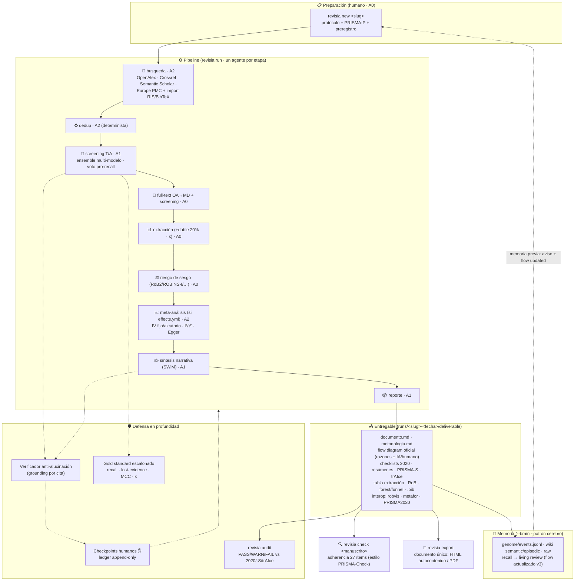

# Esquema de funcionamiento

Una revisión sistemática end-to-end pasa por **tres planos**: el flujo PRISMA
(agentes mono-tarea con autonomía declarada), la **defensa en profundidad**
(verificación → HITL → gold → auditoría) y la **memoria** (living review).

## El flujo completo

## Los tres contratos del sistema

1. **Motor ↔ config**: el código (`revisia/`) no sabe nada de tu revisión;
   tu revisión (`protocols/<slug>/`) no contiene código. `protocol.yml` declara
   pregunta, bases, herramienta RoB, **proveedor LLM por etapa** y **autonomía
   por etapa** (A0–A3; el juicio nunca supera A1).
2. **Toda llamada a IA deja huella**: `RunMeta` (modelo, versión, seed,
   temperatura, hash de prompt/respuesta) + `decisions_ledger.jsonl` (quién
   decidió qué, con qué autonomía, cuándo). El manifiesto reconstruye la corrida.
3. **Nada se afirma sin evidencia**: las citas pasan grounding antes del gate
   humano; las métricas se calculan contra gold humano (nunca "accuracy"); la
   auditoría verifica artefactos en disco, no promesas.

## Dónde está cada cosa

| Plano | Módulos | Comandos |
|---|---|---|
| Pipeline | `agents/` · `orchestration/` | `run` |
| Defensa | `rag/` (grounding) · `provenance/` · `audit.py` · `metrics.py` | `audit` · `gold-template` · `validate` |
| Memoria | `memory/` (patrón [cerebro](https://github.com/jhonmosquerav/cerebro)) | `brain` · `run --brain` |
| Reporte | `exports/` (flow oficial, checklists, interop, documento único) | `run` (emite todo) · `export` (HTML autocontenido / PDF) |
| Adherencia | `check.py` | `check` |
| Config | `protocols/_TEMPLATE/` (protocol.yml · PRISMA-P · gold · effects) | `new` |
